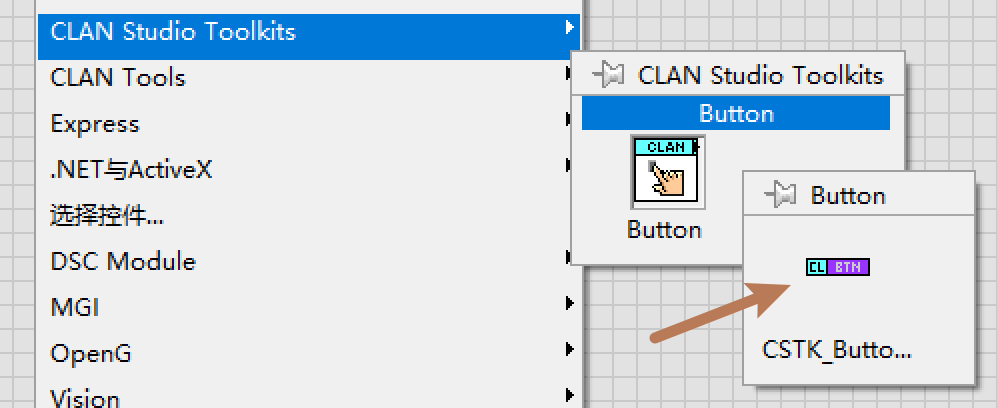
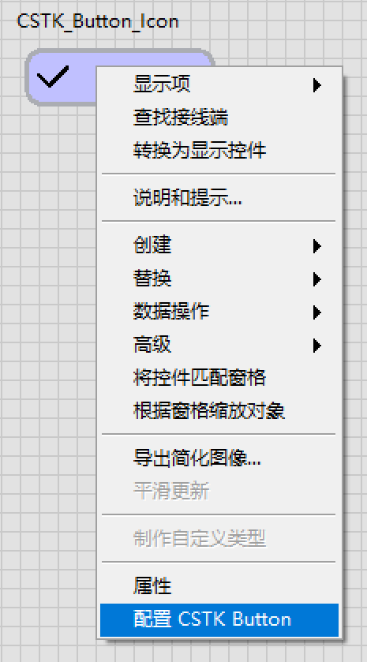
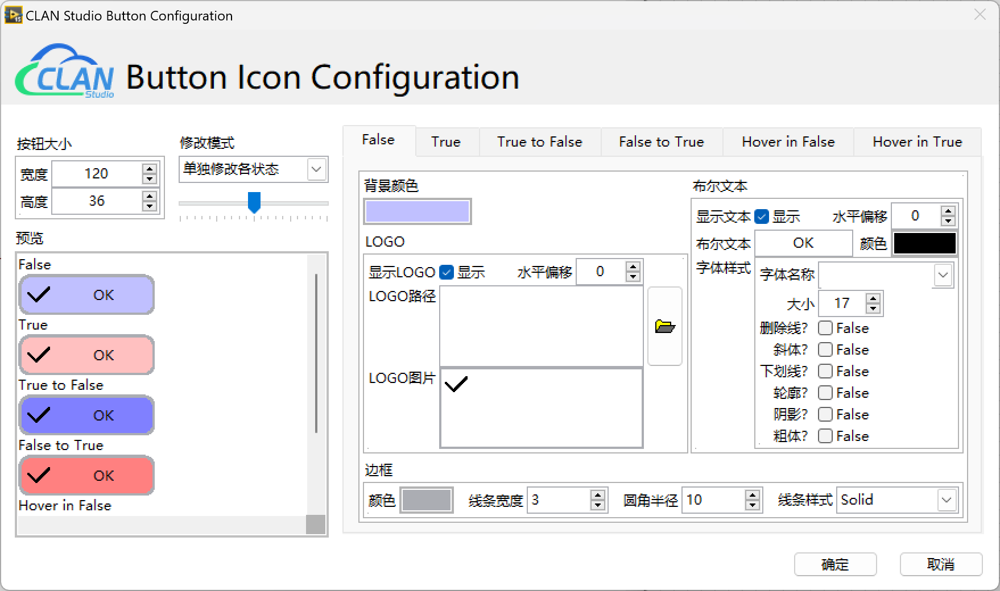

# CLAN Studio Toolkits - Button Icon

仓库地址：[CSTK_Button_Icon](https://github.com/clan4456/CSTK_Button_Icon)

下载地址：[clan_studio_lib_cstk_button_icon-1.0.0.1.vip](https://github.com/clan4456/CSTK_Button_Icon/releases/download/v1.0.0.1/clan_studio_lib_cstk_button_icon-1.0.0.1.vip)

SHA-256：e1a03961a9cbfe6b968d429cbf484fd6b91a60df077bd6457c0ee196e390f040

## 1. 简介

本控件使用XControl开发，利用二维图片控件，实现按钮的6种状态（False、True、True to False、False to True、Hover in False、Hover in True）的实时重绘，以满足对按钮外观进行实时配置。

## 2. 主要特性

- 使用LabVIEW原生方式实现6状态按钮的生成与配置，无需引入其他库或工具包

- 可以通过属性节点方式，实时改变按钮的各种样式，每个状态的样式都可以独立设置

- 对每个可配置属性进行设置时，控件将实时重绘按钮

- 控件改变大小会根据已配置属性进行重绘，并不是简单的拉伸变形

- 每个状态都可以单独设置布尔字体，配置后控件直接重绘，不依赖运行时的字体文件

- 专属配置界面，可在程序开发过程中方便地进行样式配置。该界面中所有样式配置均可在程序运行过程中通过属性节点进行配置

## 3. 可配置属性

- `按钮大小` [R/W]：设置或读取按钮绘制大小（非控件大小，由于二维图片控件和XControl透明边框的存在，控件大小比按钮绘制大小的宽度和高度均增加13px）

- `背景颜色` [R/W]：设置或读取按钮的背景颜色（支持透明色）

- `边框颜色` [R/W]：设置或读取按钮的边框颜色（支持透明色）

- `边框属性`
  
  - `线条宽度` [R/W]：设置或读取按钮边框的线条宽度（设置为0则为无边框）
  - `线条样式` [R/W]：设置或读取按钮边框的线条样式（可设置实线Solid、短横线Dash、点线Dot、横点线DashDot、横点点线DashDotDot）
  - `圆角半径` [R/W]：设置或读取按钮边框的圆角半径（设置为0则为直角）

- `布尔文本` [R/W]：设置或读取按钮的布尔文本

- `布尔文本属性`
  
  - `水平偏移` [R/W]：设置或读取按钮布尔文本的水平偏移像素值（为0则紧贴LOGO右侧，负值向左偏移，正值向右偏移）
  
  - `文本颜色` [R/W]：设置或读取按钮布尔文本的文本颜色（不支持透明色）
  
  - `显示文本` [R/W]：设置或读取按钮布尔文本的显示状态（True为显示文本，False为不显示文本。当文本设置为不显示时，LOGO图标将默认水平居中）
  
  - `字体样式` [R/W]：设置或读取按钮布尔文本的字体样式（可设置字体、大小、粗体、斜体、删除线、下划线等各种样式。如需字体设置为空，则其他样式均不生效，默认使用LabVIEW中的应用程序字体样式）

- `LOGO图像` [R/W]：设置或读取按钮的LOGO图标图像数据

- `LOGO属性`
  
  - `水平偏移` [R/W]：设置或读取按钮LOGO图标的水平偏移（为0则不偏移，负值向左偏移，正值向右偏移）
  
  - `显示LOGO` [R/W]：设置或读取按钮LOGO图标的显示状态（True为显示LOGO图标，False为不显示LOGO图标。当LOGO图标设置为不显示时，布尔文本将默认水平居中）

- `按钮图像` [R]：读取绘制后的按钮各种状态图像

## 4. 前置库

无

## 5. 安装Button Icon

下载Releases中的 [clan_studio_lib_cstk_button_icon-1.0.0.1.vip](https://github.com/clan4456/CSTK_Button_Icon/releases/download/v1.0.0.1/clan_studio_lib_cstk_button_icon-1.0.0.1.vip)，并双击通过VIPM进行安装。（需安装VIPM 2017或以上版本）

## 6. 使用Button Icon

### 6.1 放置控件

安装 ***Button Icon*** 后，可通过LabVIEW前面板的控件选板-->“CLAN Studio Toolkits”-->“Button”-->"CSTK_Button_Icon"，选择并拖放至前面板合适位置中。

### 6.2 配置控件

放置 ***Button Icon*** 后，可通过右击控件，选择“配置 CSTK Button”，打开控件专属配置对话进行样式配置。

### 6.3 样式配置

打开 ***Button Icon Configuration*** 对话框后，可通过右侧选项卡各页，对控件的6种状态进行独立配置。

其中，修改模式有以下三种模式：

- `单独修改各状态`：默认模式，6种状态全部开发独立配置。

- `统一修改T/F状态`：只开放False和True两种状态进行配置。配置后，其他状态均关联至这两种状态（Ture to False和Hover in False关联至False，False to True和Hover in True关联至True，该设置一般用于显示控件配置，此时转换过度状态和鼠标浮动状态与普通状态一致，相当于取消过度状态和鼠标浮动状态）

- `统一修改全部状态`：只开放False状态进行配置。配置后，其他所有状态均关联至False状态）

预览窗口可观察到实时重绘的6种状态预览图。预览窗口上方的横向滑动杆用于放大或缩小预览窗口中的图像。

## 7. 已知bug

暂未发现

## 8. 开源许可

本工具遵循BSD开源协议，可任意分发或二次开发使用。但需保留UI界面上的CLAN Studio标志即可。

## 9. 关于捐赠

作者开发不易，如对本工具使用效果满意，同时经济允许的情况下，可向作者相赠一杯咖啡，感谢！本工具为免费开源，仅接受微信公众号（请使用微信扫描下方二维码关注 `CLAN Studio` 公众号）文章打赏，其他途径均非作者本意，请注意分辨，谢谢！

